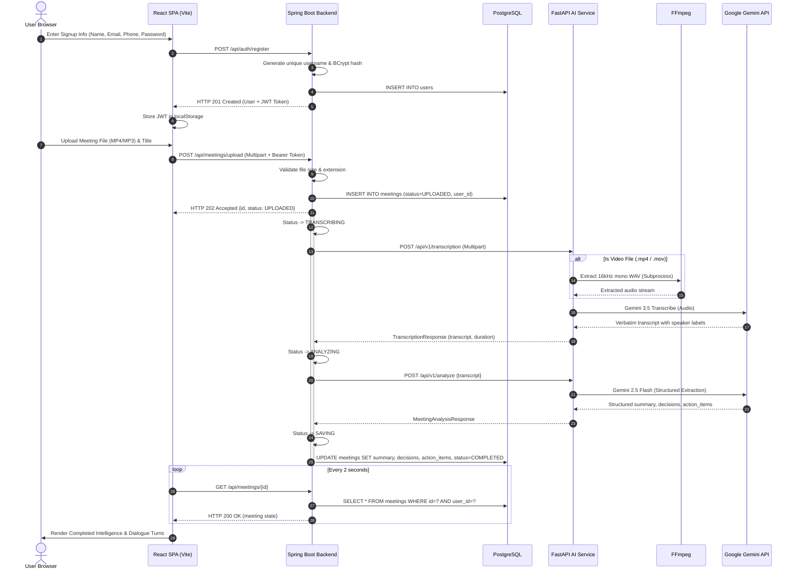

# AI Meeting Summarizer — System Architecture & Technical Design

This document details the architectural design, component layers, security models, data flows, and engineering decisions implemented in the AI Meeting Summarizer platform.

---

## 1. System Overview

The application converts recorded audio and video meetings into structured, actionable intelligence (summaries, confirmed decisions, and assigned action items). It is organized as a decoupled multi-service system:

```text
                                  BROWSER (Client Tier)
                                            │
                                            ▼
                                  ┌──────────────────┐
                                  │   React + Vite   │
                                  │   (Port 3000)    │
                                  └────────┬─────────┘
                                           │ /api (Nginx Reverse Proxy)
                                           ▼
                                  ┌──────────────────┐
                                  │   Spring Boot    │
                                  │   (Port 8080)    │
                                  │ (JWT Auth + JPA) │
                                  └──────┬─────┬─────┘
                                         │     │
                                JDBC     │     │ HTTP REST
                                         │     │
                                         ▼     ▼
                                ┌──────────┐  ┌────────────────┐
                                │PostgreSQL│  │    FastAPI     │
                                │(Port 5432│  │  (Port 8000)   │
                                │Users/Mtgs│  │ (Media + AI)   │
                                └──────────┘  └───────┬────────┘
                                                      │
                                                      │ FFmpeg (Audio Extraction)
                                                      ▼
                                              Google Gemini API
                                              (External Cloud HTTPS)
```

---

## 2. Component Architecture

### 2.1 Frontend Layer (`frontend/`)
Built with **React 19**, **TypeScript**, and **Vite**, served in production via **Nginx 1.27**.

```text
frontend/src/
├── components/
│   ├── common/       # Logo, FileDropZone, UploadCard, ProcessingStatus, ConfirmDialog, ErrorBoundary
│   ├── layout/       # AppLayout, Header (auth bar + breadcrumbs), Sidebar (responsive drawer <= 1024px)
│   ├── meeting/      # MeetingSummary, KeyDecisions, ActionItems, Transcript, MeetingCard, MeetingList, MeetingFilters
│   └── ui/           # Button, Card, Badge, Toast, Modal, Skeleton, PageHeader
├── context/          # AuthContext (JWT state, user profile, login/logout, redirect retention)
├── hooks/            # useAuth, useMeetingProcessing (polling controller), useToast
├── pages/            # Home, Meetings, MeetingDetails, Settings, Login, Signup, NotFound
├── services/         # api.ts (Axios HTTP client with Bearer token injection and error handling)
├── types/            # TypeScript domain interfaces (Meeting, User, Auth, ActionItem, Status)
└── utils/            # fileValidation, formatDuration, formatDate, exportMeeting, meetingDisplay
```

- **Reverse Proxy Strategy**: In production, the client SPA makes relative requests to `/api/*`. Nginx handles reverse proxying to Spring Boot on `backend:8080`, eliminating browser CORS complexities.
- **Session & Auth State**: Managed by `AuthContext`. Tokens are persisted in `localStorage` under `auth_token` and automatically injected into every outgoing request via Axios request interceptors.
- **Client Polling**: The `useMeetingProcessing` hook polls `GET /api/meetings/{id}` every 2 seconds during active processing stages and automatically disengages once the status reaches `COMPLETED` or `FAILED`.
- **Export Engine**:
  - `exportMeetingToMarkdown`: Formats title, status, duration, date, executive summary, decisions, action checklist, and verbatim transcript into a standard Markdown blob and triggers client-side file download.
  - `exportMeetingToPdf`: Triggers `window.print()` with dedicated `@media print` rules hiding navigation chrome, sidebar, and headers, outputting an executive report.

---

### 2.2 Backend Application Layer (`backend/`)
Built with **Java 21**, **Spring Boot 4.1**, and **Spring Data JPA**.

```text
backend/src/main/java/com/meeting/
├── client/           # AiServiceClient (REST client calling FastAPI with connect/read timeouts)
├── config/           # SecurityConfig (JWT filter chain), WebMvcConfig, AsyncConfig
├── controller/       # AuthController (/api/auth/*), MeetingController (/api/meetings/*), HealthController
├── dto/              # Auth & Meeting DTOs with Bean Validation (@NotBlank, @Email, @Size)
├── entity/           # User and Meeting (JPA entities with foreign key scoping and JSONB mapping)
├── exception/        # GlobalExceptionHandler, ResourceNotFoundException, UnauthorizedException
├── repository/       # UserRepository and MeetingRepository
├── service/          # UserService, MeetingService, MeetingProcessingService, TemporaryFileService
└── util/             # JwtUtil (HMAC-SHA256 signer), UsernameGenerator, SecurityUtils
```

- **Authentication & Security Architecture**:
  - Implemented via Spring Security filter chain with a custom `JwtAuthenticationFilter`.
  - Passwords are encrypted using Spring's `BCryptPasswordEncoder` with strength 10.
  - Generates HMAC-SHA256 signed JWT tokens containing user ID, username, and email.
- **Username Generation Subsystem**:
  - `UsernameGenerator` cleans the user's full name, formats it to lowercase snake-case (`alex_m`), and handles collision resolution by querying `userRepository.existsByUsernameIgnoreCase` and appending incremental counters (`alex_m1`, `alex_m2`).
- **User-Isolated Meeting Scoping**:
  - Every meeting belongs to a `user_id` foreign key referencing the `users` table.
  - `MeetingService` queries enforce tenant isolation: `findByUserIdOrderByCreatedAtDesc` ensures users can only read, analyze, or delete their own meetings.
- **Async Task Coordination**: Upload requests return immediately with `202 Accepted`. `MeetingProcessingService` orchestrates the pipeline (`UPLOADED` → `TRANSCRIBING` → `ANALYZING` → `SAVING` → `COMPLETED`) via an internal `ThreadPoolTaskExecutor`.
- **Concurrency Protection**: An active in-memory lock set (`ConcurrentHashMap`) ensures the same meeting is never processed concurrently by duplicate triggers.

---

### 2.3 AI & Media Processing Microservice (`ai-service/`)
Built with **Python 3.13**, **FastAPI**, **Pydantic**, and **FFmpeg**.

```text
ai-service/app/
├── api/routes/       # health, process, transcription, analyze, gemini
├── config.py         # Pydantic BaseSettings, environment loading, path resolution
├── models/           # Pydantic schemas (TranscriptionResponse, MeetingAnalysisResponse, ActionItem)
├── services/         # gemini_service.py, media_service.py, ffmpeg_service.py
└── main.py           # FastAPI application entrypoint with middleware
```

- **FFmpeg Subprocess Isolation**: Audio extraction from MP4/MOV videos is executed with `shell=False` through a parameterized subprocess command with an enforced 600-second timeout.
- **Gemini API Integration**: Uses Google's official `google-genai` SDK:
  - **Gemini 3.5 Transcribe**: Audio file transcription with speaker diarization and timestamp parsing.
  - **Gemini 2.5 Flash**: Zero-hallucination structured analysis extracting summaries, confirmed decisions, and action checklists.

---

## 3. Data Flow & Execution Sequence



---

## 4. Architectural Decision Records (ADRs)

### ADR 1: Decoupled Python AI Service vs. Monolithic Java
- **Context**: Video extraction and modern GenAI SDKs are heavily optimized and maintained in Python, whereas enterprise security, JPA transactions, and multi-tenant scoping excel in Java.
- **Decision**: Decouple the compute-intensive AI operations into a stateless Python FastAPI microservice, orchestrated asynchronously by Spring Boot.
- **Outcome**: Spring Boot handles tenant security, JWT validation, and transactional persistence. FastAPI scales independently without risking JVM heap exhaustion.

### ADR 2: In-Container FFmpeg Subprocess Extraction
- **Context**: Video meetings (.mp4, .mov) can be 50–100 MB, while the audio content is only ~5–10 MB. Sending raw video to cloud LLMs wastes bandwidth and exceeds API limits.
- **Decision**: Package FFmpeg inside the AI service Docker container to strip video streams and extract 16kHz mono WAV before cloud transmission.
- **Outcome**: Network payload to Gemini is reduced by ~85%, improving transcription speed and reliability.

### ADR 3: Stateless JWT Authentication with Dual-Identifier Sign In
- **Context**: Users need convenient authentication using either email or generated username, while keeping backend services stateless and container-friendly.
- **Decision**: Issue HMAC-SHA256 signed JWTs on successful registration or login.
- **Outcome**: Zero session clustering or distributed cache (Redis) required for horizontally scaled backend instances.

### ADR 4: 1024px Responsive Drawer Breakpoint
- **Context**: Modern tablets (iPad Air 820px, iPad Pro 834px, Galaxy Tab 800-1000px) suffered from severe content cramping when a permanent 260px sidebar remained visible.
- **Decision**: Elevate the off-canvas mobile drawer breakpoint from `768px` to `1024px`.
- **Outcome**: Tablets and mobile devices enjoy edge-to-edge screen real estate with on-demand navigation, while desktop screens retain the pinned sidebar.
