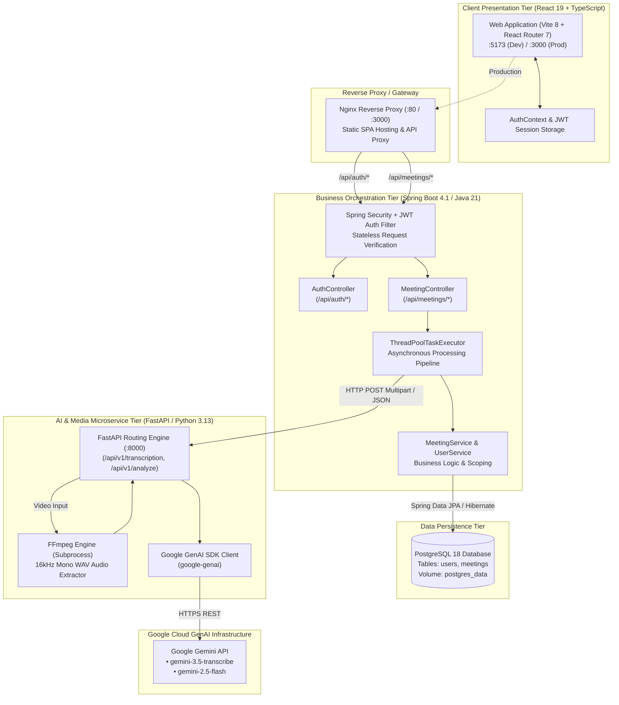

# AI Meeting Summarizer

An enterprise-grade, full-stack intelligence platform that transforms raw audio and video meeting recordings into structured, high-value executive intelligence. Upload any meeting recording to automatically receive precise verbatim transcripts with speaker diarization, executive summaries, formally agreed-upon key decisions, and actionable deliverables with assignees and due dates.

Includes stateless JWT user authentication, automatic unique username generation, user-isolated meeting records, one-click export to PDF & Markdown, and comprehensive multi-device responsiveness across smartphones, tablets, laptops, and desktops.

---

## Table of Contents

- [Overview](#overview)
- [Key Features](#key-features)
- [System Architecture](#system-architecture)
- [Technology Stack Matrix](#technology-stack-matrix)
- [Application Workflow](#application-workflow)
- [Database Schema & Models](#database-schema--models)
- [Supported Media Specifications](#supported-media-specifications)
- [Project Directory Structure](#project-directory-structure)
- [Prerequisites](#prerequisites)
- [Quick Start with Docker](#quick-start-with-docker)
- [Local Development Setup](#local-development-setup)
- [Environment Variables](#environment-variables)
- [API Reference](#api-reference)
  - [Authentication Endpoints](#authentication-endpoints)
  - [Meeting Management Endpoints](#meeting-management-endpoints)
  - [AI & Media Microservice Endpoints](#ai--media-microservice-endpoints)
- [Automated Testing Suite](#automated-testing-suite)
- [Security, Privacy & Reliability](#security-privacy--reliability)
- [Multi-Device Responsiveness Matrix](#multi-device-responsiveness-matrix)
- [Documentation Index](#documentation-index)

---

## Overview

Modern product, engineering, and executive teams spend hundreds of hours in meetings every month. Critical commitments, architectural trade-offs, and deadlines are frequently lost or miscommunicated in unstructured discussions. 

**AI Meeting Summarizer** solves this with a resilient, decoupled three-tier processing pipeline:
1. **Media Ingestion**: Accepts audio (`MP3`, `WAV`, `M4A`) and video (`MP4`, `MOV`) recordings up to 100 MB.
2. **Audio Extraction**: In-container FFmpeg subprocess extracts high-fidelity 16kHz mono audio from video files without external cloud transcoding costs.
3. **Conversational Speech-to-Text**: Converts speech to text with speaker diarization and millisecond timestamp recognition powered by Google Gemini.
4. **Structured Meeting Intelligence**: Strict zero-hallucination prompt contracts extract structured executive summaries, confirmed decisions, and assigned action checklists.
5. **Security & User Isolation**: JWT-backed authentication ensures each user's uploaded meetings, transcripts, and account settings are securely isolated and tenant-scoped.
6. **Export & Portability**: Instantly download meeting intelligence as structured Markdown (`.md`) reports or print/save as clean, executive-ready PDFs.

---

## Key Features

- **Audio & Video Support**: Ingest audio files (`MP3`, `WAV`, `M4A`) and video recordings (`MP4`, `MOV`).
- **Automated In-Memory Video Extraction**: In-container parameterized FFmpeg pipeline converts video streams to 16kHz mono WAV for audio transcription.
- **Accurate Speech-to-Text & Diarization**: Speech transcription with distinct speaker identification and conversational turnaround tracking.
- **Structured Executive Intelligence**:
  - Executive Meeting Summaries with topic breakdowns.
  - Formally agreed-upon Key Decisions.
  - Action Items with assignees and completion deadlines (preserving `null` when not explicitly designated in speech).
- **Asynchronous Non-Blocking Processing**: Fast `202 Accepted` response returns immediately upon upload; real-time stage progression tracks processing:
  $$\text{UPLOADED} \longrightarrow \text{TRANSCRIBING} \longrightarrow \text{ANALYZING} \longrightarrow \text{SAVING} \longrightarrow \text{COMPLETED / FAILED}$$
- **User Authentication & Auto-Generated Usernames**:
  - Secure registration requiring full name, email, country code, and 10-digit mobile number.
  - Automatic unique username generation based on user's real name (e.g. `@alex_m`, `@alex_m1`).
  - Dual-identifier sign-in: users can authenticate via email address OR `@username`.
  - BCrypt-hashed password storage and signed stateless JWT session tokens.
- **Unified Profile & System Settings**:
  - Single consolidated settings workspace containing System Preferences, Personal Profile, and Password Management tabs.
- **Interactive Search & History Filtering**:
  - Real-time search across meeting titles, summaries, and transcripts.
  - Date preset filters (`All Time`, `Today`, `Past 7 Days`, `Past 30 Days`, `This Month`).
  - Status filters (`All Status`, `Completed`, `Processing`, `Failed`) with live result counters.
- **One-Click Document Export**:
  - **Export to Markdown (`.md`)**: Automatically generates formatted meeting minutes ready for Notion, Obsidian, GitHub, or documentation repositories.
  - **Export to PDF**: Dedicated `@media print` CSS layout strips navigation chrome and outputs clean executive briefing reports.
- **Universal Multi-Device Responsiveness**:
  - Native drawer breakpoint at `1024px` for Apple iPads and Android tablets.
  - Fluid grid layouts supporting Samsung Galaxy devices (320px–412px), Apple iPhones (375px–430px), laptops, and 4K displays without horizontal scrolling.

---

## System Architecture



For in-depth architectural patterns, sequence diagrams, and Architectural Decision Records (ADRs), see [ARCHITECTURE.md](./ARCHITECTURE.md).

---

## Technology Stack Matrix

| Tier | Technology / Library | Version | Role in Architecture |
| :--- | :--- | :--- | :--- |
| **Frontend** | React | `19.0.0` | Declarative component UI |
| | TypeScript | `5.7.2` | Static type safety and data models |
| | Vite | `8.3.0` | Ultra-fast ESM module bundler and dev server |
| | React Router | `7.1.3` | Client-side routing and protected routes |
| | Lucide React | `0.475.0` | Modern, consistent vector iconography |
| | Node Test Runner | Node 20+ | Unit and helper test verification |
| **Backend** | Spring Boot | `4.1.0` | Enterprise application runtime and DI |
| | Java (Eclipse Temurin) | `21-LTS` | Modern LTS Java runtime environment |
| | Spring Security | `6.x` | Stateless JWT authentication & authorization |
| | Spring Data JPA / Hibernate | `6.x` | Object-relational mapping and entity persistence |
| | jjwt (Java JWT) | `0.12.6` | Signed HMAC-SHA256 JWT generation and validation |
| | JUnit 5 & Mockito | `5.x` | Automated backend unit and integration testing |
| **AI Microservice**| FastAPI | `0.115.0+` | High-performance Python async REST framework |
| | Python | `3.13` | Microservice runtime environment |
| | Pydantic | `2.x` | Request/response validation and strict schemas |
| | Google GenAI SDK | `0.1.1+` | Official SDK communicating with Gemini models |
| | FFmpeg | `6.0+` | Audio extraction and audio format normalization |
| | Pytest | `9.1.1` | Automated testing with mocked AI pipelines |
| **Data & Infra** | PostgreSQL | `18-Alpine` | Relational storage with foreign-key integrity |
| | Nginx | `1.27-Alpine` | Production reverse proxy, gzip, and SPA router |
| | Docker & Compose | `v24+ / v2.20+` | Multi-container orchestration |

---

## Application Workflow

```text
1. USER REGISTRATION / LOGIN
   User enters credentials -> Spring Boot validates & returns Signed JWT token.
   Token stored in client storage; attached to all outgoing requests via Authorization: Bearer <token>.

2. MEETING UPLOAD
   User selects audio or video file (up to 100 MB) on Home screen.
   Client sends POST /api/meetings/upload with multipart form data.
   Spring Boot validates file, records Meeting entity with user_id, status = UPLOADED.
   HTTP 202 Accepted returned to client in < 200ms.

3. ASYNCHRONOUS PIPELINE EXECUTION (Background ThreadPool)
   Stage 1: TRANSCRIBING
   ├── Spring Boot forwards file to FastAPI /api/v1/transcription.
   ├── If Video (.mp4, .mov): FFmpeg extracts 16kHz mono WAV in container temporary storage.
   └── Gemini 3.5 Transcribe converts speech to text with speaker labels and timestamps.

   Stage 2: ANALYZING
   ├── Spring Boot sends transcript to FastAPI /api/v1/analyze.
   └── Gemini 2.5 Flash extracts:
       ├── Executive Meeting Summary (structured markdown)
       ├── Formally agreed Key Decisions (string array)
       └── Action Items (description, owner, deadline)

   Stage 3: SAVING
   └── Persists transcript, summary, decisions, action items to PostgreSQL; status = COMPLETED.
   └── Ephemeral media files in temp directories automatically wiped.

4. REAL-TIME CLIENT SYNC & PRESENTATION
   Client polls GET /api/meetings/{id} every 2 seconds.
   On status = COMPLETED, client renders executive cards, speaker dialogue turns, and export buttons.
```

---

## Database Schema & Models

```sql
-- Users Table
CREATE TABLE users (
    id UUID PRIMARY KEY DEFAULT gen_random_uuid(),
    full_name VARCHAR(100) NOT NULL,
    username VARCHAR(50) UNIQUE NOT NULL,
    email VARCHAR(150) UNIQUE NOT NULL,
    password VARCHAR(255) NOT NULL,
    country_code VARCHAR(10) NOT NULL,
    mobile_number VARCHAR(20) NOT NULL,
    created_at TIMESTAMP WITH TIME ZONE DEFAULT CURRENT_TIMESTAMP,
    updated_at TIMESTAMP WITH TIME ZONE DEFAULT CURRENT_TIMESTAMP
);

-- Meetings Table
CREATE TABLE meetings (
    id UUID PRIMARY KEY DEFAULT gen_random_uuid(),
    user_id UUID NOT NULL REFERENCES users(id) ON DELETE CASCADE,
    title VARCHAR(200) NOT NULL,
    original_file_name VARCHAR(255) NOT NULL,
    file_type VARCHAR(50),
    duration INTEGER,
    status VARCHAR(30) NOT NULL,
    transcript TEXT,
    summary TEXT,
    key_decisions JSONB,
    action_items JSONB,
    created_at TIMESTAMP WITH TIME ZONE DEFAULT CURRENT_TIMESTAMP,
    updated_at TIMESTAMP WITH TIME ZONE DEFAULT CURRENT_TIMESTAMP
);

-- Indices for rapid querying
CREATE INDEX idx_users_username ON users(username);
CREATE INDEX idx_users_email ON users(email);
CREATE INDEX idx_meetings_user_id ON meetings(user_id);
CREATE INDEX idx_meetings_created_at ON meetings(created_at DESC);
```

---

## Supported Media Specifications

| Media Type | Supported Extensions | Max File Size | Audio Pipeline Strategy |
| :--- | :--- | :--- | :--- |
| **Audio** | `.mp3`, `.wav`, `.m4a` | 100 MB | Direct streaming to Gemini Transcribe |
| **Video** | `.mp4`, `.mov` | 100 MB | Parameterized FFmpeg extraction to 16kHz mono WAV |

---

## Project Directory Structure

```text
AI-Meeting-Summarizer/
├── .env.example                  # Environment configuration template
├── docker-compose.yml            # Complete 4-service Docker orchestration
├── README.md                     # Master project documentation
├── ARCHITECTURE.md               # Architecture design & ADRs
├── TESTING_GUIDE.md              # Automated commands & manual testing walkthrough
├── API.md                        # Complete REST API specifications
├── DEVELOPMENT.md                # Local developer setup guide
├── DOCKER.md                     # Container deployment instructions
├── TROUBLESHOOTING.md            # Diagnostics & issue resolution guide
│
├── frontend/                     # React 19 + TypeScript SPA
│   ├── src/
│   │   ├── components/           # UI, Layout, Meeting, and Common components
│   │   │   ├── common/           # Logo, DropZone, UploadCard, ProcessingStatus
│   │   │   ├── layout/           # Header, Sidebar, AppLayout
│   │   │   ├── meeting/          # MeetingCard, MeetingFilters, MeetingHeader, MeetingSummary, Transcript
│   │   │   └── ui/               # Button, Card, Badge, Toast, Modal, Skeleton
│   │   ├── context/              # AuthContext session management
│   │   ├── hooks/                # useAuth, useMeetingProcessing, useToast
│   │   ├── pages/                # Home, Meetings, MeetingDetails, Settings, Login, Signup, NotFound
│   │   ├── services/             # Axios API client with auth interceptors
│   │   ├── types/                # TypeScript interfaces (Meeting, User, Auth, API)
│   │   └── utils/                # Validation, formatting, markdown stripping, export utils
│   ├── nginx.conf                # Production reverse proxy config
│   └── Dockerfile                # Multi-stage build (Node 22 -> Nginx 1.27)
│
├── backend/                      # Spring Boot 4.1 Java Backend
│   ├── src/main/java/com/meeting/
│   │   ├── config/               # SecurityConfig, JwtAuthenticationFilter, WebMvcConfig
│   │   ├── controller/           # AuthController, MeetingController, HealthController
│   │   ├── dto/                  # Request/Response data transfer objects
│   │   ├── entity/               # Meeting and User JPA entities
│   │   ├── repository/           # MeetingRepository and UserRepository
│   │   ├── service/              # MeetingService, UserService, AiServiceClient, TemporaryFileService
│   │   └── util/                 # JwtUtil, UsernameGenerator, SecurityUtils
│   ├── src/test/java/            # 115 JUnit unit and integration tests
│   ├── pom.xml                   # Maven dependencies and build plugins
│   └── Dockerfile                # Multi-stage build (Maven JDK 21 -> JRE 21)
│
├── ai-service/                   # FastAPI Python AI Microservice
│   ├── app/
│   │   ├── api/routes/           # transcription, analyze, process, health routes
│   │   ├── config.py             # Pydantic Settings and environment configurations
│   │   ├── models/               # Pydantic contract schemas
│   │   └── services/             # gemini_service, media_service, ffmpeg_service
│   ├── tests/                    # 81 Pytest test modules
│   ├── requirements.txt          # Python library dependencies
│   └── Dockerfile                # Python 3.13-slim + FFmpeg Alpine container
│
└── scripts/                      # Cross-platform automated test runners
    ├── run_all_tests.ps1         # PowerShell test executor
    └── run_all_tests.sh          # Bash test executor
```

---

## Prerequisites

### For Running via Docker Compose (Recommended)
- **Docker Engine** (v24+) & **Docker Compose** (v2.20+)
- **Google Gemini API Key** (from [Google AI Studio](https://aistudio.google.com/))
*(No local Java, Python, or Node installation required)*

### For Running Locally on Host Machine
- **Java JDK 21+**
- **Python 3.13+**
- **Node.js 20+** & **npm**
- **PostgreSQL 16+** running on `localhost:5432`
- **FFmpeg 6.0+** available in system `PATH`
- **Google Gemini API Key**

---

## Quick Start with Docker

1. **Clone the repository**:
   ```bash
   git clone https://github.com/kanhaiya28pandey/AI-Meeting-Summarizer.git
   cd AI-Meeting-Summarizer
   ```

2. **Configure your environment**:
   ```bash
   cp .env.example .env
   ```
   Open `.env` and configure your secret key:
   ```env
   GEMINI_API_KEY=your_actual_gemini_api_key_here
   DB_PASSWORD=your_secure_db_password
   JWT_SECRET=your_super_secret_jwt_key_at_least_32_characters_long
   ```

3. **Build and launch all 4 services**:
   ```bash
   docker compose up --build
   ```

4. **Open the application**:
   - Web Application: **[http://localhost:3000](http://localhost:3000)**
   - Backend Health Check: **[http://localhost:8080/api/health](http://localhost:8080/api/health)**
   - AI Service Health Check: **[http://localhost:8000/api/health](http://localhost:8000/api/health)**

---

## Local Development Setup

To run services natively on your local machine:

### 1. PostgreSQL Database
```sql
CREATE DATABASE meeting_summarizer;
CREATE USER meeting_user WITH PASSWORD '12345';
GRANT ALL PRIVILEGES ON DATABASE meeting_summarizer TO meeting_user;
```

### 2. AI Microservice (FastAPI)
```bash
cd ai-service
python -m venv .venv
# Windows: .\.venv\Scripts\Activate.ps1 | Linux/macOS: source .venv/bin/activate
pip install -r requirements.txt
python -m uvicorn app.main:app --reload --host 0.0.0.0 --port 8000
```

### 3. Backend (Spring Boot)
```bash
cd backend
# Windows:
$env:DB_PASSWORD="12345"; .\mvnw.cmd spring-boot:run
# Linux/macOS:
DB_PASSWORD="12345" ./mvnw spring-boot:run
```

### 4. Frontend (React + Vite)
```bash
cd frontend
npm install
npm run dev
```
Open **[http://localhost:5173](http://localhost:5173)** in your browser.

---

## Environment Variables

| Variable | Tier | Purpose | Default / Example |
| :--- | :--- | :--- | :--- |
| `DB_URL` | Backend | PostgreSQL JDBC URL | `jdbc:postgresql://localhost:5432/meeting_summarizer` |
| `DB_USERNAME` | Backend | PostgreSQL user | `meeting_user` |
| `DB_PASSWORD` | Backend | PostgreSQL password | `12345` |
| `JWT_SECRET` | Backend | 256-bit secret key for signing tokens | *(Minimum 32 chars)* |
| `JWT_EXPIRATION_MS` | Backend | JWT validity duration (milliseconds) | `86400000` (24 Hours) |
| `AI_SERVICE_URL` | Backend | Microservice connection URL | `http://localhost:8000` |
| `GEMINI_API_KEY` | AI Service | Google Gemini API key | *(Required secret)* |
| `GEMINI_MODEL` | AI Service | Model for intelligence extraction | `gemini-2.5-flash` |
| `GEMINI_TRANSCRIPTION_MODEL` | AI Service | Model for speech transcription | `gemini-3.5-transcribe` |
| `FFMPEG_PATH` | AI Service | FFmpeg executable location | `ffmpeg` |
| `MAX_AUDIO_FILE_SIZE_MB` | AI Service | Max allowable upload size | `100` |

---

## API Reference

### Authentication Endpoints

| Method | Endpoint | Description | Auth Required |
| :--- | :--- | :--- | :--- |
| `POST` | `/api/auth/register` | Register new user; automatically generates `@username` | Public |
| `POST` | `/api/auth/login` | Authenticate with email or `@username` + password; returns JWT | Public |
| `GET` | `/api/auth/me` | Fetch currently authenticated user session details | Bearer Token |
| `PUT` | `/api/auth/profile` | Update profile information (name, email, mobile) | Bearer Token |
| `PUT` | `/api/auth/change-password` | Update account password with verification | Bearer Token |

### Meeting Management Endpoints

| Method | Endpoint | Description | Auth Required |
| :--- | :--- | :--- | :--- |
| `POST` | `/api/meetings/upload` | Upload audio/video media (Multipart); returns `202 Accepted` | Optional / Scoped |
| `GET` | `/api/meetings` | List all meeting records owned by authenticated user | Bearer Token |
| `GET` | `/api/meetings/{id}` | Retrieve meeting intelligence, status, transcript, summary | Bearer Token |
| `DELETE`| `/api/meetings/{id}` | Permanently delete meeting record | Bearer Token |
| `POST` | `/api/meetings/{id}/process` | Trigger re-analysis of existing meeting | Bearer Token |

### AI & Media Microservice Endpoints

| Method | Endpoint | Description | Status |
| :--- | :--- | :--- | :--- |
| `GET` | `/api/health` | Microservice liveness probe | `200 OK` |
| `POST` | `/api/v1/transcription` | Audio/video transcription with speaker diarization | `200 OK` |
| `POST` | `/api/v1/analyze` | Synthesis of executive summary, decisions, action items | `200 OK` |
| `POST` | `/api/v1/process` | Full pipeline orchestration acknowledgement | `200 OK` |

For full request/response JSON schemas, header contracts, and curl examples, see [API.md](./API.md).

---

## Automated Testing Suite

The repository maintains an automated test matrix with **254 automated tests** passing across all layers:

```bash
# Run the complete project test runner:
pwsh -File .\scripts\run_all_tests.ps1   # Windows
./scripts/run_all_tests.sh              # Linux/macOS
```

### Test Results Breakdown

1. **Frontend Tier (React + TypeScript)**:
   - **61 tests passing** via Node Test Runner.
   - Tests file validation (audio/video extensions, 100MB limits, invalid formats), duration formatters, date formatters, API error mappers, markdown strippers, confirmation dialogs, and auth storage contracts.
   - Production bundle compiled with **zero TypeScript errors** in 219ms.

2. **Backend Tier (Spring Boot + JUnit 5)**:
   - **115 tests passing** with 0 errors and 0 failures.
   - Covers user registration, username generator collisions, BCrypt authentication, JWT creation and validation, meeting isolation scoping, concurrency locks, and JPA transactions.

3. **AI Microservice Tier (FastAPI + Pytest)**:
   - **78 tests passing** (3 skipped live tests).
   - Covers audio/video format detection, FFmpeg command array injection prevention, timeout handling, mocked Gemini response schemas, and boundary contracts.

For manual self-testing scenarios and step-by-step verification flows, consult [TESTING_GUIDE.md](./TESTING_GUIDE.md).

---

## Security, Privacy & Reliability

- **Stateless JWT Architecture**: User sessions are authenticated via HMAC-SHA256 signed JSON Web Tokens. No session state is held in server memory.
- **Tenant Data Isolation**: All meeting queries are strictly scoped by the authenticated user's ID (`WHERE user_id = :userId`).
- **Subprocess Safety**: FFmpeg processes run with `shell=False` passing argument arrays strictly, completely preventing shell injection.
- **Path Traversal Protection**: Filenames are sanitized through alphanumeric whitelisting before touching temporary storage.
- **Ephemeral Media Processing**: Audio and video binaries are stored in isolated temporary directories and deleted immediately upon pipeline completion.
- **Zero Secrets in Repository**: Sensitive credentials (`GEMINI_API_KEY`, `JWT_SECRET`, `DB_PASSWORD`) are loaded strictly from environment variables.

---

## Multi-Device Responsiveness Matrix

| Device Category | Target Viewports | Responsive Adaptations |
| :--- | :--- | :--- |
| **Mobile Phones** | `320px` – `480px`<br>*(Samsung Galaxy, iPhone SE, iPhone 14/15/16)* | • Sidebar collapses to mobile drawer with backdrop.<br>• Full-width search input and 50% split filter dropdowns.<br>• Meeting action buttons wrap into equal-width touch-friendly grid.<br>• Action submit button expands to full width.<br>• Single-column auth forms without horizontal scrolling. |
| **Tablets** | `768px` – `1024px`<br>*(iPad Air, iPad Pro, Samsung Galaxy Tab)* | • Drawer breakpoint set to `1024px` to avoid crushing content with a fixed 260px sidebar.<br>• 2-column feature grids.<br>• Dynamic padding and card layouts. |
| **Laptops & Desktops**| `1280px` – `4K Ultra HD` | • Persistent dark navy sidebar.<br>• Maximum container bounds (`1040px` / `1200px`) preventing awkward over-stretching.<br>• Fluid clamp typography. |

---

## Documentation Index

- [ARCHITECTURE.md](./ARCHITECTURE.md) — Detailed system architecture, sequence diagrams, and ADRs.
- [TESTING_GUIDE.md](./TESTING_GUIDE.md) — Comprehensive automated testing commands and step-by-step user testing guide.
- [API.md](./API.md) — Full REST API documentation, request/response bodies, and validation rules.
- [DEVELOPMENT.md](./DEVELOPMENT.md) — Local non-Docker developer environment setup guide.
- [DOCKER.md](./DOCKER.md) — Docker containerization, volume persistence, and Compose operations.
- [TROUBLESHOOTING.md](./TROUBLESHOOTING.md) — Solutions for port conflicts, database resets, and common errors.
