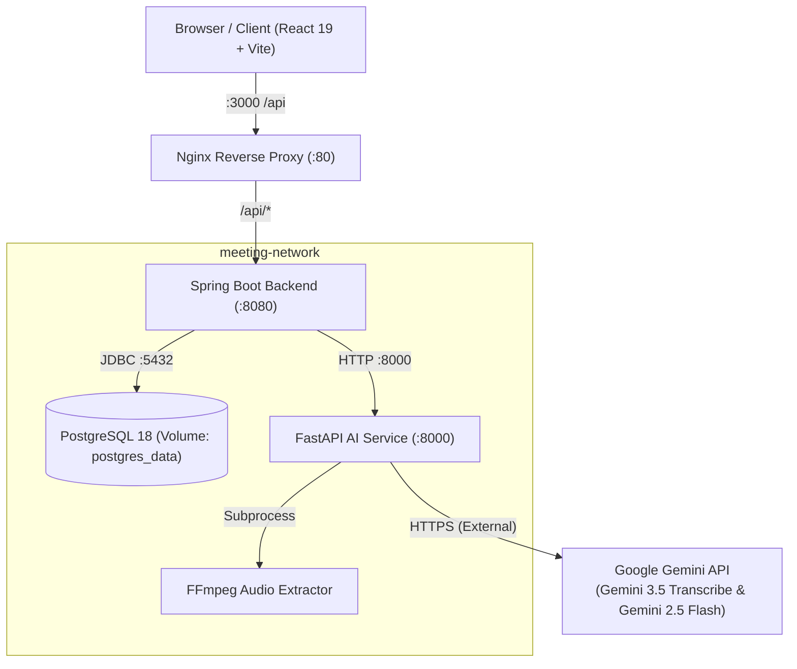

# AI Meeting Summarizer

An end-to-end full-stack application that transforms audio and video meeting recordings into structured meeting intelligence. Users can upload recordings to automatically generate clean transcripts, executive summaries, confirmed key decisions, and assigned action items with deadlines.

---

## Table of Contents

- [Overview](#overview)
- [Key Features](#key-features)
- [Architecture](#architecture)
- [Technology Stack](#technology-stack)
- [Application Workflow](#application-workflow)
- [Supported Media](#supported-media)
- [Project Structure](#project-structure)
- [Prerequisites](#prerequisites)
- [Quick Start with Docker](#quick-start-with-docker)
- [Local Development Setup](#local-development-setup)
- [Environment Variables](#environment-variables)
- [API Overview](#api-overview)
- [Automated Testing](#automated-testing)
- [Security & Reliability](#security--reliability)
- [Known Limitations](#known-limitations)
- [Future Improvements](#future-improvements)
- [Project UI & Screenshots](#project-ui--screenshots)
- [What This Project Demonstrates](#what-this-project-demonstrates)
- [Documentation Index](#documentation-index)

---

## Overview

In modern engineering and product teams, hours of discussion are lost without accurate post-meeting documentation. **AI Meeting Summarizer** solves this by providing a reliable processing pipeline:
1. **Accepts media files** (`MP3`, `WAV`, `M4A`, `MP4`, `MOV`) up to 100 MB.
2. **Extracts audio** automatically from video recordings using FFmpeg.
3. **Transcribes speech** using Google Gemini 3.5 Transcribe with timestamps and speaker attribution.
4. **Extracts intelligence** using Gemini 2.5 Flash under a strict zero-hallucination prompt contract to identify confirmed decisions and assigned action items.
5. **Persists and presents results** via a responsive, accessible React interface backed by Spring Boot and PostgreSQL.

---

## Key Features

- **Audio & Video Support**: Upload audio recordings (`MP3`, `WAV`, `M4A`) or video meetings (`MP4`, `MOV`).
- **Automated Video Extraction**: In-container FFmpeg pipeline converts video audio to a clean 16kHz WAV stream before transcription.
- **Accurate Speech-to-Text**: Speech transcription with speaker diarization and timestamp recognition powered by Gemini 3.5 Transcribe.
- **Structured Intelligence Extraction**:
  - Executive meeting summaries.
  - Formally agreed-upon key decisions.
  - Action items with assignees and due dates (preserving `null` when not explicitly stated).
- **Asynchronous Pipeline**: Upload endpoints return `202 Accepted` immediately, allowing real-time status tracking (`UPLOADED` → `TRANSCRIBING` → `ANALYZING` → `SAVING` → `COMPLETED` / `FAILED`).
- **Meeting Management & History**: View, search, inspect, copy, and delete meeting records with destructive confirmation dialogs.
- **Modern Accessible UI**: Responsive light workspace canvas, dark navy sidebar, accessible toast notifications, and skeleton shimmer loaders.
- **Containerized Stack**: Complete multi-tier Docker Compose setup with internal networking, health checks, and persistent volumes.

---

## Architecture



For an in-depth exploration of architecture patterns, component design, and architectural decision records (ADRs), read [ARCHITECTURE.md](./ARCHITECTURE.md).

---

## Technology Stack

### Frontend
- **Framework**: React 19, TypeScript
- **Bundler & Tooling**: Vite 8, oxlint
- **Routing**: React Router 7
- **Testing**: Vitest 5, React Testing Library, JSDOM
- **Production Server**: Nginx 1.27 Alpine

### Backend
- **Framework**: Spring Boot 4.1, Spring Data JPA, Spring WebMVC
- **Language & Runtime**: Java 21 (Eclipse Temurin)
- **Database Driver**: PostgreSQL JDBC Driver
- **Testing**: JUnit 5, Mockito 5, AssertJ, Awaitility, MockMvc

### AI & Media Service
- **Framework**: FastAPI, Uvicorn, Pydantic 2, Pydantic Settings
- **Language & Runtime**: Python 3.13
- **AI SDK**: Google GenAI SDK (`google-genai`)
- **Media Processing**: FFmpeg
- **Testing**: Pytest 8, HTTPX TestClient, pytest-cov

### Database & Infrastructure
- **Database**: PostgreSQL 18 (Alpine)
- **Containerization**: Docker, Docker Compose (Multi-stage builds, non-root users)

---

## Application Workflow

```text
User selects media (MP3/WAV/M4A/MP4/MOV)
        │
        ▼
Spring Boot accepts upload & creates meeting record (Status: UPLOADED)
        │
        ▼
HTTP 202 Accepted returned to client with Meeting ID
        │
        ▼ [Asynchronous Execution on Background Thread]
Status: TRANSCRIBING
        │
        ├─► [If Video]: FFmpeg extracts 16kHz mono WAV stream
        │
        ▼
Gemini 3.5 Transcribe converts speech to text (Transcript saved)
        │
        ▼
Status: ANALYZING
        │
        ▼
Gemini 2.5 Flash extracts summary, decisions, and action items
        │
        ▼
Status: SAVING
        │
        ▼
Results persisted in PostgreSQL 18
        │
        ▼
Status: COMPLETED
        │
        ▼
Frontend polling detects completion & renders meeting results
```

---

## Supported Media

| Media Type | Supported Formats | Max File Size | Processing Method |
| :--- | :--- | :--- | :--- |
| **Audio** | `.mp3`, `.wav`, `.m4a` | 100 MB | Direct Gemini audio transcription |
| **Video** | `.mp4`, `.mov` | 100 MB | FFmpeg audio extraction → Gemini transcription |

*Note: Visual video analysis (OCR, face detection) is not performed. The video file is used to extract high-fidelity audio for transcription.*

---

## Project Structure

```text
AI-Meeting-Summarizer/
├── backend/                  # Spring Boot 4.1 Java backend
│   ├── src/main/java/        # Application source code
│   ├── src/test/java/        # Automated test suites
│   ├── pom.xml               # Maven project descriptor
│   └── Dockerfile            # Multi-stage JDK 21 -> JRE 21 build
├── ai-service/               # FastAPI AI & media microservice
│   ├── app/                  # FastAPI routes, schemas, services
│   ├── tests/                # Pytest unit and integration suites
│   ├── requirements.txt      # Python dependencies
│   └── Dockerfile            # Python 3.13 + FFmpeg container
├── frontend/                 # React 19 + TypeScript frontend
│   ├── src/                  # Components, pages, hooks, services
│   ├── tests/                # Vitest & React Testing Library suites
│   ├── nginx.conf            # Reverse proxy & SPA routing config
│   └── Dockerfile            # Multi-stage Node 22 -> Nginx build
├── scripts/                  # Unified cross-platform test scripts
│   ├── run_all_tests.ps1     # PowerShell multi-tier test runner
│   └── run_all_tests.sh      # Bash multi-tier test runner
├── docker-compose.yml        # Orchestration definition for all 4 services
├── .env.example              # Environment configuration template
├── README.md                 # Main project guide
├── ARCHITECTURE.md           # Architectural design & ADRs
├── API.md                    # REST API specifications
├── DEVELOPMENT.md            # Local non-Docker developer guide
├── TESTING.md                # Multi-tier testing guide
├── DOCKER.md                 # Containerization & Compose operations
└── TROUBLESHOOTING.md        # Diagnostics & solutions guide
```

---

## Prerequisites

### For Running via Docker (Recommended)
- **Docker Engine** (v24+) & **Docker Compose** (v2.20+)
- **Google Gemini API Key** (from [Google AI Studio](https://aistudio.google.com/))
*(No local Java, Python, Node, or PostgreSQL required)*

### For Local Development (Without Docker)
- **Java JDK 21+**
- **Python 3.13+**
- **Node.js 20+** & **npm**
- **PostgreSQL 16+** (running on port 5432)
- **FFmpeg 6.0+** (available in system `PATH`)
- **Google Gemini API Key**

---

## Quick Start with Docker

1. **Clone the repository**:
   ```bash
   git clone https://github.com/kanhaiya28pandey/AI-Meeting-Summarizer.git
   cd AI-Meeting-Summarizer
   ```

2. **Configure environment variables**:
   ```bash
   cp .env.example .env
   ```
   Open `.env` and insert your Gemini API key:
   ```env
   GEMINI_API_KEY=your_actual_gemini_api_key_here
   ```

3. **Build and launch the application**:
   ```bash
   docker compose up --build
   ```

4. **Access the application**:
   - Web Application: [http://localhost:3000](http://localhost:3000)
   - Backend Health Check: [http://localhost:8080/api/health](http://localhost:8080/api/health)

For advanced Docker commands, volume management, and container diagnostics, see [DOCKER.md](./DOCKER.md).

---

## Local Development Setup

To run each service individually on your host machine:

### 1. Database (PostgreSQL)
Create the database and user on `localhost:5432`:
```sql
CREATE DATABASE meeting_summarizer;
CREATE USER meeting_user WITH PASSWORD 'change_me';
GRANT ALL PRIVILEGES ON DATABASE meeting_summarizer TO meeting_user;
```

### 2. Backend (Spring Boot)
```bash
cd backend
# Windows:
.\mvnw.cmd spring-boot:run -DDB_PASSWORD=change_me
# Linux/macOS:
./mvnw spring-boot:run -DDB_PASSWORD=change_me
```
*Backend runs on http://localhost:8080.*

### 3. AI Service (FastAPI)
```bash
cd ai-service
python -m venv .venv
# Activate:
# Windows: .\.venv\Scripts\Activate.ps1
# Linux/macOS: source .venv/bin/activate
pip install -r requirements.txt
uvicorn app.main:app --reload --host 0.0.0.0 --port 8000
```
*AI Service runs on http://localhost:8000 (OpenAPI docs at `/docs`).*

### 4. Frontend (React + Vite)
```bash
cd frontend
npm ci
npm run dev
```
*Frontend runs on http://localhost:5173.*

For detailed local setup workflows, read [DEVELOPMENT.md](./DEVELOPMENT.md).

---

## Environment Variables

| Variable | Service | Purpose | Default / Example |
| :--- | :--- | :--- | :--- |
| `DB_URL` | Backend | PostgreSQL JDBC connection URL | `jdbc:postgresql://localhost:5432/meeting_summarizer` |
| `DB_USERNAME` | Backend, DB | PostgreSQL username | `meeting_user` |
| `DB_PASSWORD` | Backend, DB | PostgreSQL password | `change_me` |
| `AI_SERVICE_URL` | Backend | FastAPI base endpoint | `http://localhost:8000` (Docker: `http://ai-service:8000`) |
| `GEMINI_API_KEY` | AI Service | Google Gemini API secret key | *(Required secret)* |
| `GEMINI_MODEL` | AI Service | Model for summarization & analysis | `gemini-2.5-flash` |
| `GEMINI_TRANSCRIPTION_MODEL` | AI Service | Model for audio transcription | `gemini-3.5-transcribe` |
| `FFMPEG_PATH` | AI Service | Path to FFmpeg executable | `ffmpeg` |
| `MAX_AUDIO_FILE_SIZE_MB` | AI Service | Upload file limit | `100` |
| `MAX_EXTRACTED_AUDIO_SIZE_MB` | AI Service | Max allowable extracted WAV size | `500` |
| `FRONTEND_PORT` | Docker | Host port for Web UI | `3000` |
| `BACKEND_PORT` | Docker | Host port for Backend API | `8080` |

---

## API Overview

### Spring Boot Endpoints
| Method | Endpoint | Description | Status |
| :--- | :--- | :--- | :--- |
| `GET` | `/api/health` | Service liveness probe | `200 OK` |
| `GET` | `/api/health/readiness` | Database connection readiness probe | `200 OK` / `503` |
| `POST` | `/api/meetings/upload` | Upload audio/video media (Multipart) | `202 Accepted` |
| `GET` | `/api/meetings` | List all meetings (newest first) | `200 OK` |
| `GET` | `/api/meetings/{id}` | Get meeting details and results | `200 OK` / `404` |
| `DELETE`| `/api/meetings/{id}` | Delete meeting record | `204 No Content` |
| `POST` | `/api/meetings/{id}/process` | Trigger / retry meeting processing | `202 Accepted` |

### FastAPI AI Service Endpoints
| Method | Endpoint | Description | Status |
| :--- | :--- | :--- | :--- |
| `GET` | `/api/health` | AI service liveness probe | `200 OK` |
| `POST` | `/api/v1/transcription` | Audio/video transcription via Gemini | `200 OK` |
| `POST` | `/api/v1/analyze` | Transcript summarization & analysis | `200 OK` |
| `POST` | `/api/v1/process` | Processing delegation acknowledgement | `200 OK` |
| `POST` | `/api/v1/gemini/test` | Live Gemini connectivity test | `200 OK` |

For request/response schemas, validation rules, and curl examples, see [API.md](./API.md).

---

## Automated Testing

The codebase maintains rigorous automated test suites across all application tiers:

```bash
# Run the complete multi-tier test runner:
pwsh -File .\scripts\run_all_tests.ps1   # Windows
./scripts/run_all_tests.sh              # Linux/macOS
```

### Tier Breakdown
- **Spring Boot Backend**: 97 tests passing (JUnit 5, Mockito, concurrency race tests, JPA repositories).
- **FastAPI AI Service**: 76 tests passing, 81% core code coverage (Pytest, mocked Gemini SDK, FFmpeg parameter unit tests).
- **React Frontend**: 32 tests passing, 0 lint errors, clean production bundle (Vitest, RTL, JSDOM).

Read [TESTING.md](./TESTING.md) for full testing philosophy and opt-in live test documentation.

---

## Security & Reliability

- **Input Sanitization**: Whitelist-based filename sanitization preventing path traversal (`..`) and shell injection.
- **Subprocess Safety**: FFmpeg executed strictly via parameterized argument arrays (`shell=False`) with an enforced 600-second execution timeout.
- **Prompt Injection Hardening**: Strict boundary markers and explicit prompt directives instructing Gemini to treat transcript content purely as raw data.
- **Ephemeral Storage**: Media files are processed in container temporary directories (`/tmp/`) and wiped immediately after analysis.
- **Zero Secrets in Git**: Automated secret scanning and strict `.gitignore` configurations ensure keys and credentials are never checked into version control.

---

## Known Limitations

- **In-Process Task Scheduling**: Asynchronous processing runs via Spring Boot's internal `ThreadPoolTaskExecutor`. Restarting the backend container during active processing terminates that specific in-flight job.
- **No User Accounts**: Authentication and multi-user tenant isolation are not currently implemented.
- **Media Ephemerality**: Audio and video binaries are not permanently stored; only transcripts, summaries, and meeting metadata are retained.

---

## Future Improvements

- [ ] Distributed message queue (Kafka / RabbitMQ / Redis) for durable worker processing.
- [ ] User authentication and role-based access control (RBAC).
- [ ] Cloud object storage integration (AWS S3 / Google Cloud Storage) for optional permanent media retention.
- [ ] Search and keyword filtering across meeting transcripts and summaries.
- [ ] Export formats (PDF, Markdown, Notion, Jira action item sync).

---

## Project UI & Screenshots

*(Add your application screenshots here)*

- **Home & Upload Screen**: Drag-and-drop audio/video upload with format detection, character counters, and size validation.
- **Processing View**: Real-time stage tracker with animated status indicators.
- **Meeting Details Screen**: Clean presentation of summary, key decisions, action items with assignees/due dates, and readable transcript with one-click clipboard copy.
- **Meeting History**: Dashboard displaying all recorded meetings with processing badges and deletion modals.

---

## What This Project Demonstrates

- **Full-Stack System Architecture**: Clean decoupling between React SPA, Java business orchestration, Python AI processing, and PostgreSQL storage.
- **Microservice Design**: Independent scaling of compute-intensive AI operations from transactional business logic.
- **Production Hardening**: Strict input validation, path traversal prevention, command injection safety, and resilient error boundaries.
- **Modern Containerization**: Multi-stage Docker builds, non-root runtimes, health-check synchronization, and Nginx reverse proxying.
- **Quality Assurance**: 205+ automated tests across Java, Python, and TypeScript tiers.

---

## Documentation Index

- [ARCHITECTURE.md](./ARCHITECTURE.md) — System architecture, data flow diagrams, and architectural decision records (ADRs).
- [API.md](./API.md) — Complete REST API reference, request/response bodies, and validation rules.
- [DEVELOPMENT.md](./DEVELOPMENT.md) — Step-by-step local developer guide without Docker.
- [TESTING.md](./TESTING.md) — Test strategy, suite breakdowns, coverage reports, and runner commands.
- [DOCKER.md](./DOCKER.md) — Containerization guide, Compose commands, volume persistence, and networking.
- [TROUBLESHOOTING.md](./TROUBLESHOOTING.md) — Common errors, port conflicts, database recoveries, and solutions.
